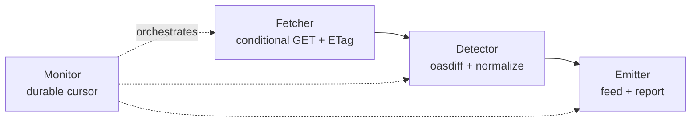

# openapi-change-feed

A consumer-agnostic OpenAPI change-detection engine. It compares two OpenAPI
specifications (a pinned baseline against the current HEAD), classifies what
changed, and emits a structured change feed plus a human-readable report for
downstream tooling.

It was built to watch [github/rest-api-description](https://github.com/github/rest-api-description),
which publishes GitHub's REST API as OpenAPI but ships no machine-readable "what
changed" signal. The engine is self-contained and knows nothing about any
specific consumer, so the same feed can drive any client that needs to react to
API changes.

## How it works



1. **Fetch** the HEAD spec over HTTP with an `If-None-Match` conditional GET, so
   an unchanged spec is a cheap 304 no-op.
2. **Diff** the baseline against HEAD with [oasdiff](https://github.com/oasdiff/oasdiff)
   v1.20.0 (handles OpenAPI 3.0 and 3.1), then **normalize** the result into
   stable records: a `kind` (for example `operation.added`), a `severity`
   (`breaking` / `warn` / `info`), and a coverage guard that flags changes the
   normalizer could not map.
3. **Emit** three artifacts and advance a durable cursor only after a fully
   successful emit, so a failed emit retries the same window on the next run.

## Output artifacts

Written to the `--out` directory (default `out/`):

| File | Description |
|------|-------------|
| `changes.json` | The full batch for one diff: metadata, every change record, and a summary count. Validated against `internal/output/feed.schema.json` by `ValidateFeed`. |
| `feed.jsonl` | Append-only log, one change record per line. At-least-once: deduped per spec window, but dedupe on each record's `fingerprint` to be safe. |
| `report.md` | Deterministic human-readable report, ordered by severity then path. |

Records carry a stable `fingerprint` (the unique key to dedupe on) and a
`severity` of `info`, `warn`, or `breaking`. The schema and delivery semantics
are documented in [docs/change-schema.md](docs/change-schema.md).

## Build

Requires Go 1.26 or newer.

```sh
go build ./...
```

## Usage

```sh
openapi-change-feed detect \
  --spec-url "https://raw.githubusercontent.com/github/rest-api-description/main/descriptions/api.github.com/api.github.com.json" \
  --out out \
  --cursor state/cursor.json
```

| Flag | Default | Description |
|------|---------|-------------|
| `--spec-url` | (none) | URL of the OpenAPI spec to monitor. |
| `--out` | `out` | Output directory for the feed artifacts. |
| `--cursor` | `state/cursor.json` | Path to the durable cursor state file. |

The first run for a fresh cursor establishes a baseline and emits nothing
(there is nothing to diff yet). Each later run diffs the stored baseline against
HEAD, emits the feed when the spec changed, and advances the cursor. An
unchanged spec prints `spec unchanged; nothing to do` and exits cleanly.

## Packages

| Package | Responsibility |
|---------|----------------|
| `internal/changes` | The shared data contract: `ChangeRecord`, `ChangeBatch`, `Summary`, `Severity`, `ChangeKind`. |
| `internal/specfetch` | Conditional-GET HTTP fetcher with ETag handling. |
| `internal/detector` | oasdiff wrapper, normalization, the `Detect()` entry point, and the coverage guard. |
| `internal/output` | File emitter, deterministic report, and feed schema. |
| `internal/monitor` | Orchestration and the durable, crash-safe cursor. |
| `cmd/openapi-change-feed` | The `detect` command-line entry point. |

## Testing

```sh
go test ./...
```

The detector ships an anchor regression that pins the engine's output against a
real change window from `github/rest-api-description` (total 348, breaking 36,
warn 70, info 242, with 6 operations added and 2 removed). The expected counts
live in [docs/ground-truth.md](docs/ground-truth.md). The fixtures are large, so
the test skips when they are absent; fetch them and force the assertion with:

```sh
bash script/fetch-anchor.sh
ANCHOR_REQUIRED=1 go test ./internal/detector -run TestAnchorWindowPinnedCounts -v
```

## Automation

- `.github/workflows/ci.yml` builds, runs the race suite, and runs the anchor
  regression with `ANCHOR_REQUIRED=1` so the pinned counts can never silently
  drift.
- `.github/workflows/detect.yml` runs `detect` on a schedule and opens or
  updates a pull request with the refreshed feed. It is a portable artifact:
  GitHub only runs workflows from a repository root, so it stays inert until
  this module is lifted into its own repository.
